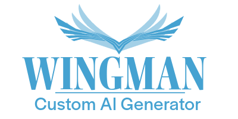
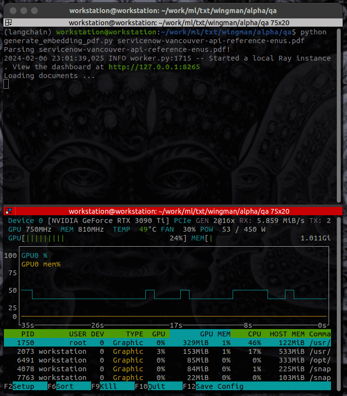

<!-- Improved compatibility of back to top link: See: https://github.com/othneildrew/Best-README-Template/pull/73 -->
<a name="readme-top"></a>
<!--
*** Thanks for checking out the Best-README-Template. If you have a suggestion
*** that would make this better, please fork the repo and create a pull request
*** or simply open an issue with the tag "enhancement".
*** Don't forget to give the project a star!
*** Thanks again! Now go create something AMAZING! :D
-->


<!-- PROJECT SHIELDS -->
<!--
*** I'm using markdown "reference style" links for readability.
*** Reference links are enclosed in brackets [ ] instead of parentheses ( ).
*** See the bottom of this document for the declaration of the reference variables
*** for contributors-url, forks-url, etc. This is an optional, concise syntax you may use.
*** https://www.markdownguide.org/basic-syntax/#reference-style-links
-->

[![LinkedIn][linkedin-shield]][linkedin-url]


<!-- PROJECT LOGO -->
<div align="center">
  <h2 align="center"></h2>

  <p align="center">
    Pretrain your Machine Learning Models (LLM) with your own data
    <br />
    Comes complete with an Automated Embedding Generator and model Q&A Interface
    <br />
    <a href="#demo-animation">View Demo</a>
    ·
    <a href="https://github.com/SeeMirra/Wingman/issues/new?labels=bug">Report Bug</a>
    ·
    <a href="https://github.com/SeeMirra/Wingman/issues/new?labels=enhancement">Request Feature</a>
  </p>
</div>


<!-- TABLE OF CONTENTS -->
<details>
  <summary>Table of Contents</summary>
  <ol>
    <li>
      <a href="#about-the-project">About The Project</a>
      <ul>
        <li><a href="#demo-animation">Demo Animation</a></li>
        <li><a href="#built-with">Built With</a></li>
      </ul>
    </li>
    <li>
      <a href="#getting-started">Getting Started</a>
      <ul>
        <li><a href="#prerequisites">Prerequisites</a></li>
        <li><a href="#installation">Installation</a></li>
      </ul>
    </li>
    <li><a href="#usage">Usage</a></li>
    <li><a href="#roadmap">Roadmap</a></li>
    <li><a href="#contributing">Contributing</a></li>
    <li><a href="#license">License</a></li>
    <li><a href="#contact">Contact</a></li>
    <li><a href="#acknowledgments">Acknowledgments</a></li>
  </ol>
</details>


<!-- ABOUT THE PROJECT -->
## About The Project

Automatically Pretrain your Machine Learning Models (LLM) with:
- [x] PDF Files
- [x] Github Repositories
- [x] Scraped HTML files in a local folder

This tooling will accept input in the form of a github repo url, pdf file, or local html files folder and perform the following actions:

```
generate_embedding_github/pdf.py
• Break apart your input data into manageable chunks
• Send chunked data to Ray Serve Cluster
• Use Ray Cluster to create an embedding from our input chunks

serve run serve:deployment
• Use Ray Cluster to download a Foundational Model
• Load Foundation Model with our Embedding on top
• Start a WebServer and make the Model available via api

query.py "what is the api endpoint to get a list of agents"
• Allow you to interface with the model through the API
```

This tooling is for anyone who wants to train an LLM on a specific source of knowledge in a simple way, where all the heavy lifting has been abstracted behind-the-scenes

Wingman is built on top of a Ray Cluster so it can either be scalable and distributed, or can be run on just one machine.

<br />

---

<br />


### Demo Animation

<p align="center">
  
</p>
<p align="right"><a href="#readme-top">⬆️</a></p>


### Built With

This project (and many others) would not be possible without the following:

[![Python][Python.org]][python-url] [![Torch][PyTorch.org]][PyTorch-url] [![Ray][Ray.io]][Ray-url] [![Faiss][Faiss]][Faiss-url] [![Langchain][Langchain.org]][Langchain-url]

Link | Name | Developer | Description
-- | ---- | ---- | ----
[Link](https://github.com/facebookresearch/faiss) | Faiss | Facebook Research | A library for efficient similarity search and clustering of dense vectors.
[Link](https://github.com/langchain-ai/langchain) | LangChain | LangChain | LangChain is a framework for developing applications powered by language models.
[Link](https://github.com/ray-project/ray) | Ray | Ray Project | Ray is a unified framework for scaling AI and Python applications. Ray consists of a core distributed runtime and a set of AI Libraries for accelerating ML workloads.
[Link](https://www.python.org) | Python | Python Software Foundation | Python is a high-level, general-purpose programming language. Its design philosophy emphasizes code readability with the use of significant indentation.
[Link](https://github.com/pytorch/pytorch) | PyTorch | The Linux Foundation | Tensors and Dynamic neural networks in Python with strong GPU acceleration.
[Link](https://github.com/wention/BeautifulSoup4) | Beautiful Soup | Leonard Richardson | Beautiful Soup is a Python library for pulling data out of HTML and XML files. It works with your favorite parser to provide idiomatic ways of navigating, searching, and modifying the parse tree.
[Link](https://github.com/ilevkivskyi/typing_inspect) | Typing_Inspect | Ivan Levkivskyi | The typing_inspect module defines an experimental API for runtime inspection of types defined in the Python standard typing module.

<p align="right"><a href="#readme-top">⬆️</a></p>


<!-- GETTING STARTED -->
## Getting Started

To get a local copy up and running follow these simple steps.

### Prerequisites

- [x] 16+GB of VRam (24GB Recommended)
- [x] Whatever Python Virtual Environment You'd like<br />(We like MiniConda)

### Installation

TODO - Brief instructions below, longer ones to come later

1. pip install -r requirements.txt (May be missing a dep or two -- fixing this is on the <a href="#roadmap">roadmap</a>.)
2. python generate_embedding_pdf.py ./PathTo/local.pdf
3. serve run serve:deployment
4. python query.py "what is the api endpoint to disable data collection for a specified agent"

Adding an interim launcher as well as a UI are both on the current roadmap.

<p align="right"><a href="#readme-top">⬆️</a></p>

<!-- USAGE EXAMPLES -->
## Usage

```
python query.py "what is the api endpoint to disable data collection for a specified agent"
/api/sn_agent/agents/{agent_id}/data/off.

python query.py "what is the api endpoint for the ActivitySubscriptions API"
The API endpoint for the ActivitySubscriptions API is /now/actsub/activities.

python query.py "what is the api endpoint to get a list of agents"
The API endpoint to get a list of agents is "/api/sn_agent/agents/list.

python query.py "what is the api endpoint of the Agent Client Collector API"
The API endpoint of the Agent Client Collector API is "https://<sn_agent-host>:<sn_agent-port>/api/agent-client-collector/admin".
```

<p align="right"><a href="#readme-top">⬆️</a></p>


<!-- ROADMAP -->
## Roadmap

- [x] Create Readme
- [x] Create requirements.txt
- [ ] Refine requirements.txt
- [ ] Basic Launcher Script
- [ ] Screenshots
- [ ] User Interface
- [ ] Embedding Library
- [ ] Quantised Model Support
- [ ] trust_remote_code via kwargs
- [ ] Advanced Device_map support
- [ ] Multi-language Support
    - [ ] Chinese
    - [ ] Spanish
    - [ ] Russian

See the [open issues](https://github.com/Seemirra/Wingman/issues) for a full list of proposed features (and known issues).

<p align="right"><a href="#readme-top">⬆️</a></p>


<!-- CONTRIBUTING -->
## Contributing

Contributions are what make the open source community such an amazing place to learn, inspire, and create. Any contributions you make are **greatly appreciated**.

If you have a suggestion that would make this better, please fork the repo and create a pull request. You can also simply [open an issue with the tag "enhancement"](https://github.com/SeeMirra/Wingman/issues/new?labels=enhancement).
Don't forget to give the project a star! Thanks again!

1. [Fork the Project](https://github.com/SeeMirra/Wingman/fork)
2. Create your Feature Branch (`git checkout -b feature/AmazingFeature`)
3. Commit your Changes (`git commit -m 'Add some AmazingFeature'`)
4. Push to the Branch (`git push origin feature/AmazingFeature`)
5. [Open a Pull Request](https://github.com/SeeMirra/Wingman/compare)

<p align="right"><a href="#readme-top">⬆️</a></p>


<!-- LICENSE -->
## License

Commercial use prohibited.

Contact us for a commercial license for our Enterprise Version.

<p align="right"><a href="#readme-top">⬆️</a></p>


<!-- CONTACT -->
## Contact

Christian Mirra - [LinkedIn](https://www.linkedin.com/in/chris-mirra-375b5488/)

Project Link: [https://github.com/SeeMirra/Wingman/](https://github.com/SeeMirra/Wingman)

<p align="right"><a href="#readme-top">⬆️</a></p>


<!-- ACKNOWLEDGMENTS -->
## Acknowledgments

Todo -- This list is currently incomplete

<p align="right"><a href="#readme-top">⬆️</a></p>


<!-- MARKDOWN LINKS & IMAGES -->
<!-- https://www.markdownguide.org/basic-syntax/#reference-style-links -->

[linkedin-shield]: https://img.shields.io/badge/-LinkedIn-blue.svg?style=for-the-badge&logo=linkedin
[linkedin-url]: https://www.linkedin.com/in/chris-mirra-375b5488/
[product-screenshot]: images/screenshot.png
[Ray.io]: https://img.shields.io/badge/Ray-E56717?style=for-the-badge&logo=Ray&logoColor=white
[Ray-url]: https://ray.io/
[PyTorch.org]: https://img.shields.io/badge/pytorch-blue?style=for-the-badge&logo=pytorch&logoColor=white
[PyTorch-url]: https://PyTorch.org/
[Python.org]: https://img.shields.io/badge/Python-3776AB?style=for-the-badge&logo=python&logoColor=white
[Python-url]: https://www.python.org/
[Faiss]: https://img.shields.io/badge/Faiss-3776AB?style=for-the-badge&logo=messenger&logoColor=white
[Faiss-url]: https://github.com/facebookresearch/faiss
[Langchain.org]: https://img.shields.io/badge/LangChain-3776AB?style=for-the-badge&logoColor=white
[Langchain-url]: https://github.com/langchain-ai/langchain

